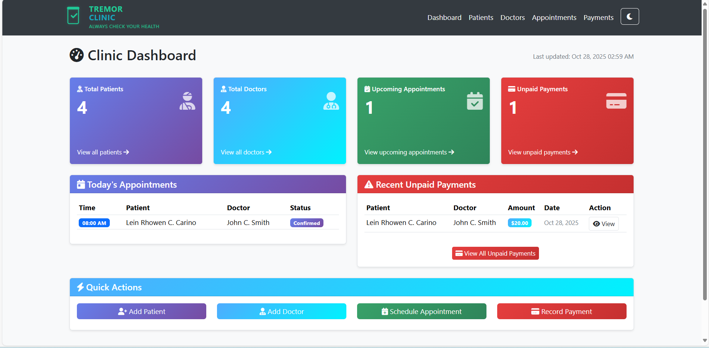
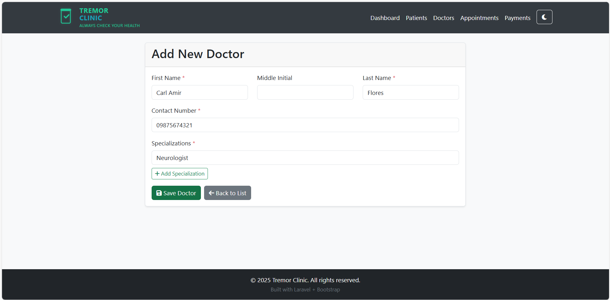
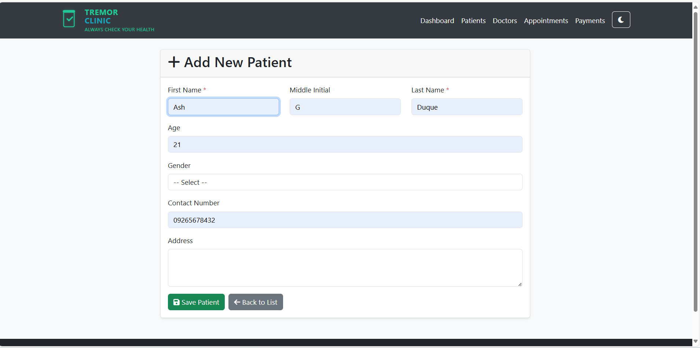
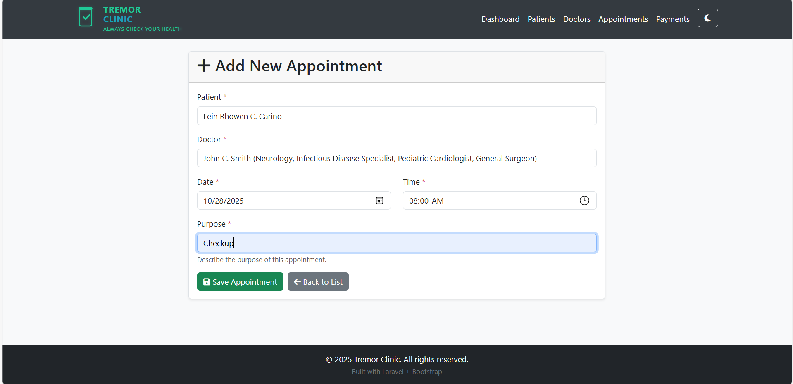
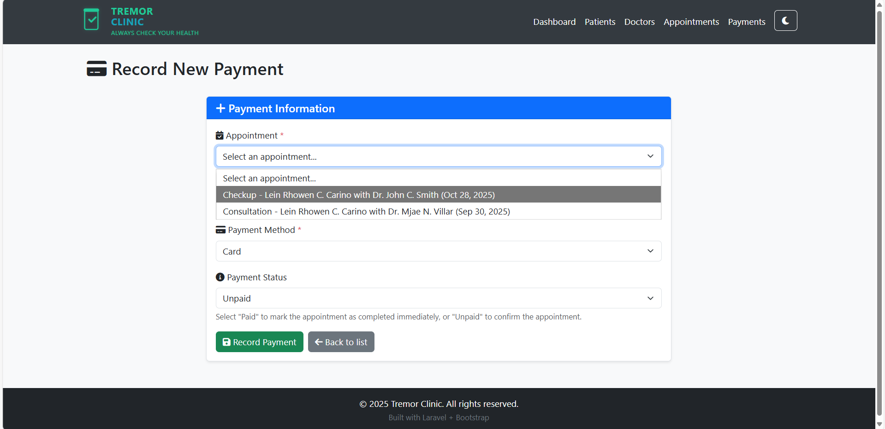

# 🖥️ CLINIC APPOINTMENT SYSTEM

---

## 📘 Description / Overview
The **Clinic Appointment System**, made by **Lein Rhowen Tremor**, is a **Transaction Processing System** designed to manage and organize patient appointments at **Tremor Clinic**.  

This system provides an efficient way for patients to book, reschedule, or cancel appointments, while allowing clinic staff to monitor schedules and manage records easily.

---

## 🎯 Objectives
To develop a web-based **Clinic Appointment System** that simplifies the scheduling process between patients and the clinic.  
- To automate the process of **booking, rescheduling, and canceling appointments** to reduce manual errors and time delays.  
- To provide an organized system for managing **patient information and appointment records**.  
- To allow clinic staff to **view, approve, or modify appointments** through an administrative interface.  
- To ensure **data accuracy, security, and accessibility** within the clinic’s database.  
- To enhance user experience by creating a **responsive and user-friendly interface** for both patients and clinic staff.  
- To demonstrate the application of **transaction processing and database management concepts** in a real-world healthcare setting.

---

## ⚙️ Features / Functionality
- **Dashboard** — provides an overview of key data such as total patients, doctors, appointments, and payments.  
- **Add Patient** — allows users to register and store patient information in the system.  
- **Add Doctor** — enables users to record doctor details for appointment assignment.  
- **Add Appointment** — users can create appointments by selecting a patient, doctor, and specifying the purpose of the visit.  
- **Add Payment** — records payment details related to confirmed appointments.  
- **CRUD Operations** — supports Create, Read, Update, and Delete functionalities for patients, doctors, appointments, and payments.  
- **Light and Dark Mode** — allows users to switch between display themes for better visibility and comfort.  
- **Data Organization** — integrates all records in a structured database for easy tracking and management.

---

## 🧩 Installation Instructions
Follow the steps below to set up and run the Clinic Appointment System on your local machine:

1. **Download or Clone the Project**
   - Download the ZIP file or clone the repository using (the repository of ACT 1):
     ```bash
     git clone https://github.com/LeinHaruki/Duque_Tremor_Act.git
     ```

2. **Move the Project Folder**
   - Extract or copy the project folder into the `htdocs` directory of your **XAMPP** installation.  
     Example path:  
     ```
     C:\xampp\htdocs\clinic-appointment-system
     ```

3. **Start XAMPP Services**
   - Open the **XAMPP Control Panel**.  
   - Start **Apache** and **MySQL** modules.

4. **Set Up the Database**
   - Open your browser and go to:  
     ```
     http://localhost/phpmyadmin
     ```
   - Create a new database named:  
     ```
     clinic_appoinment_system
     ```
   - Import the provided SQL file (e.g., `clinic_appoinment_system.sql`) into this database.

5. **Configure Database Connection**
   - Open the project’s configuration file (e.g., `dbconnect.php` or `connection.php`).
   - Make sure the following settings match your local environment:
     ```php
     $servername = "localhost";
     $username = "root";
     $password = "";
     $dbname = "clinic_appoinment_system";
     ```

6. **Run the Project**
   - Open your web browser and navigate to:
     ```
     http://127.0.0.1:8000/dashboard
     ```
   - The system’s dashboard should now be accessible and the system is ready to use.
---

## 🚀 Usage
Follow these steps to use the Clinic Appointment System efficiently:

1. **Access the System**
   - Open your browser and go to:
     ```
     http://127.0.0.1:8000/dashboard
     ```
   - The system dashboard will display summaries such as total patients, doctors, appointments, and payments.

2. **Add a Patient**
   - Navigate to the **“Add Patient”** section.  
   - Fill in the patient’s details (e.g., name, contact information, and other required fields).  
   - Click **Save** to store the record in the database.

3. **Add a Doctor**
   - Go to the **“Add Doctor”** section.  
   - Enter the doctor’s details, including their name, specialization, and contact information.  
   - Click **Save** to add the doctor to the system.

4. **Add an Appointment**
   - Open the **“Add Appointment”** page.  
   - Select an existing patient and doctor from the dropdown lists.  
   - Specify the **purpose of the appointment** and the **date/time**.  
   - Click **Submit** to create the appointment record.

5. **Add a Payment**
   - Go to the **“Add Payment”** section.  
   - Choose the corresponding appointment and enter payment details (amount, method, etc.).  
   - Once saved, the appointment will automatically update to reflect the payment status.

6. **View or Update Records**
   - Each module (Patients, Doctors, Appointments, Payments) allows you to **view, edit, or delete** existing records using the provided action buttons.

7. **Switch Themes**
   - Toggle between **Light Mode** and **Dark Mode** using the theme switcher in the interface for improved visibility and comfort.


---

## 🖼️ Screenshots or Code Snippets
Below are sample screenshots of the Clinic Appointment System interface:

#### 🏠 Dashboard


#### 👨‍⚕️ Add Doctor


#### 👩‍⚕️ Add Patient


#### 📅 Add Appointment


#### 💳 Add Payment



